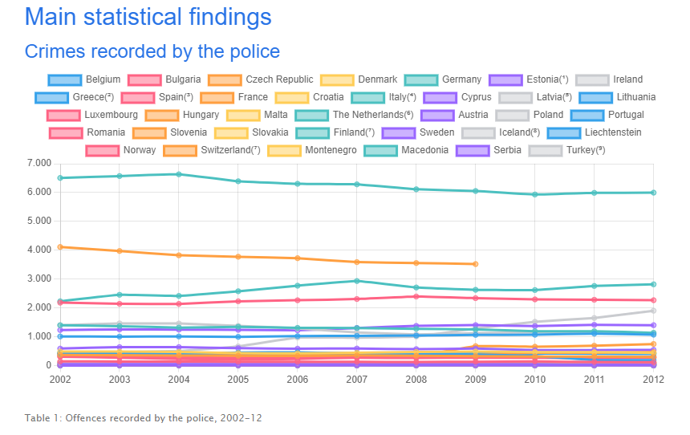
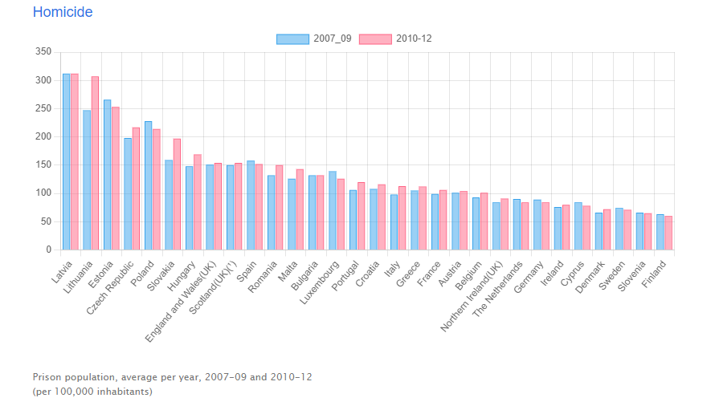
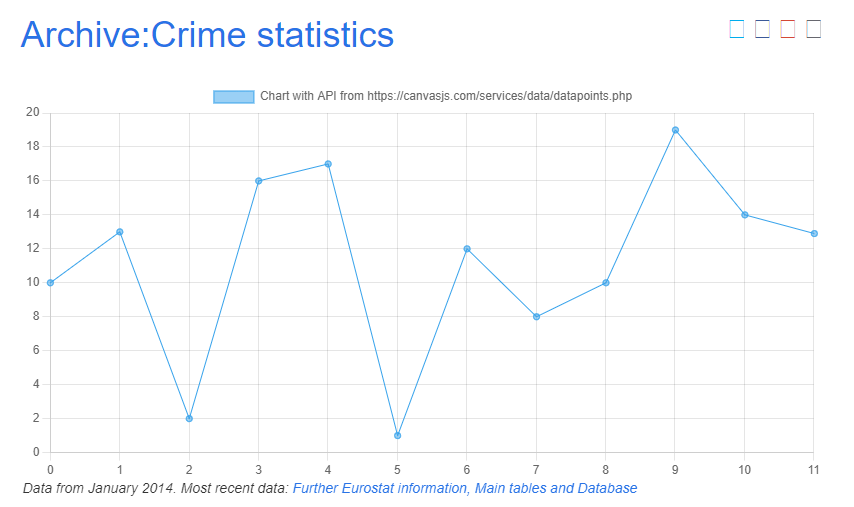

# js-datavisualisation-challenge

## Description
Challenge to strengthen the foundations in JS. Work simulation that puts us in the shoes of a developer who has received an order for the EU website where we have to add interactive data visualisation graphics using javascript with the data that we find in the provided html file.

## Images

 

## Live version
https://marinevh.github.io/js-datavisualisation-challenge/

## Code
- Javascript
- Chart.js
- Git Bash
- Ajax/JSON

Copyright - 2023